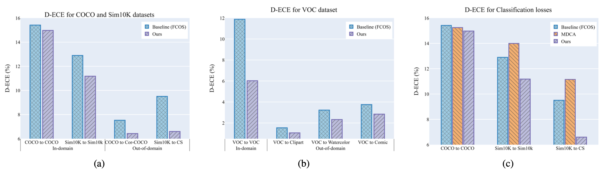
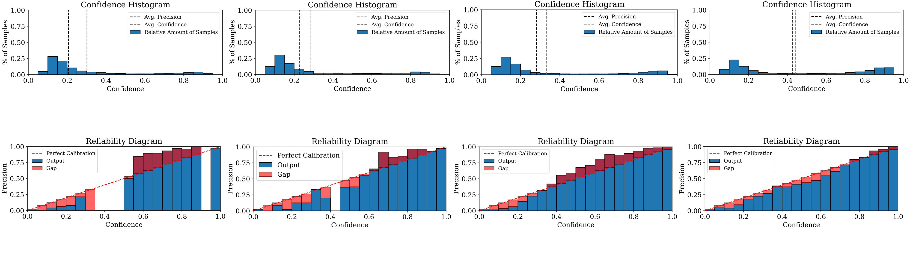
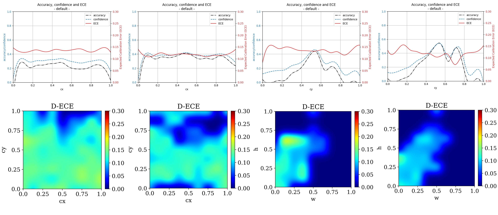

# Multiclass Confidence and Localization Calibration for Object Detection (CVPR 2023)
[Bimsara Pathiraja](https://scholar.google.es/citations?hl=en&user=7ViSGnIAAAAJ), [Malitha Gunawardhana](https://scholar.google.com/citations?user=tsvNezcAAAAJ&hl=en), [Muhammad Haris Khan](https://scholar.google.com/citations?user=ZgERfFwAAAAJ&hl=en)

[](https://openaccess.thecvf.com/content/CVPR2023/papers/Pathiraja_Multiclass_Confidence_and_Localization_Calibration_for_Object_Detection_CVPR_2023_paper.pdf) 
[](https://bimsarapathiraja.github.io/mccl-project-page/) 

<!-- [](https://arxiv.org/pdf/2207.12392.pdf)  -->
<!-- [](https://drive.google.com/file/d/1MBe7aM6M9sNhbv6f94d7UkvzseJJDw2i/view?usp=share_link) 
[](https://drive.google.com/file/d/1tM8CNjyM1EorlwA-Qv8LBmWO8Adf0MiN/view?usp=share_link) -->

> **Abstract:** *Albeit achieving high predictive accuracy across many challenging computer vision problems, recent studies suggest that deep neural networks (DNNs) tend to make overconfident predictions, rendering them poorly calibrated. Most of the existing attempts for improving DNN calibration are limited to classification tasks and restricted to calibrating in-domain predictions. Surprisingly, very little to no attempts have been made in studying the calibration of object detection methods, which occupy a pivotal space in vision-based security-sensitive, and safety-critical applications. In this paper, we propose a new train-time technique for calibrating modern object detection methods. It is capable of jointly calibrating multiclass confidence and box localization by leveraging their predictive uncertainties. We perform extensive experiments on several in-domain and out-of-domain detection benchmarks. Results demonstrate that our proposed train-time calibration method consistently outperforms several baselines in reducing calibration error for both in-domain and out-of-domain predictions.*

## Citation
If you find our work useful. Please consider giving a star :star: and a citation.
```bibtex
@InProceedings{Pathiraja_2023_CVPR,
        author    = {Pathiraja, Bimsara and Gunawardhana, Malitha and Khan, Muhammad Haris},
        title     = {Multiclass Confidence and Localization Calibration for Object Detection},
        booktitle = {Proceedings of the IEEE/CVF Conference on Computer Vision and Pattern Recognition (CVPR)},
        month     = {June},
        year      = {2023},
        pages     = {19734-19743}
```

### Contents  
1) [Highlights](#highlights) 
2) [Installation](#installation)
3) [Training and Evaluation](#training-and-evaluation)
4) [Results](#results)
5) [Visualizations](#visualizations)
6) [Contact](#contact)
7) [Acknowledgement](#acknowledgement)


### Highlights
- Towards improving the calibration performance of object detection methods, inspired by the train-time calibration route, we propose a new train-time calibration approach aims at jointly calibrating the predictive multiclass confidence and bounding box localization.
- We summarize our key contributions as follows:
**Contributions:** **(1)** We study the relatively unexplored di- rection of calibrating modern object detectors and observe that they are intrinsically miscalibrated in both in-domain and out-of-domain predictions. Also, the existing calibra- tion techniques for classification are sub-optimal for cali- brating object detectors. **(2)** We propose a new train-time calibration method for detection, at the core of which is an auxiliary loss term, which attempts to jointly calibrate multiclass confidences and bounding box localization. We leverage predictive uncertainty in multiclass confidences and bounding box localization. **(3)** Our auxiliary loss term is differentiable, operates on minibatches, and can be uti- lized with other task-specific loss functions. **(4)** We perform extensive experiments on challenging datasets, featuring several in-domain and out-of-domain scenarios. Our train- time calibration method consistently reduces the calibra- tion error across DNN-based object detection paradigms, including FCOS and Deformable DETR, both in in-domain and out-of-domain predictions.
<p align="center">
      
</p>
In the Fig. above, we show that the DNN-based object detectors are inherently miscalibrated for both in-domain and out-of-domain predictions. Also, calibration methods for image classification are sub-optimal for object detection. Our proposed train-time calibration method for object detection is capable of reducing the calibration error (D-ECE%) of DNN-based detectors in both in-domain and out-domain scenarios.


### Installation

For complete Installation, and usage instructions, follow guidelines [here](https://github.com/bimsarapathiraja/MCCL/blob/master/INSTALL.md)

### Training and Evaluation

The following command line will train FCOS_R_50_FPN_1x on 8 GPUs with 

```
python -m torch.distributed.launch \
            --nproc_per_node=8 \
            --master_port=$((RANDOM + 10000)) \
            tools/train_net.py \
            --config-file configs/fcos/fcos_R_50_FPN_1x.yaml \
            DATALOADER.NUM_WORKERS 2 \
            OUTPUT_DIR OUTPUT_DIR \
            MODEL.FCOS.LOSS_TYPE mccl \ # use MCCL loss
            MODEL.FCOS.MCCL_WEIGHT 1.0 \ # weight for the whole MCCL los
            MODEL.FCOS.NUM_MC_SAMPLES 5 \ # Number of MC dropouts
            MODEL.FCOS.MCCL_IOU_WEIGHT 0.1 \ # weight of the LC component of MCCL
            MODEL.FCOS.MCCL_CLS_DROPOUT 0.5 \ # MC dropout value for class prediction
            MODEL.FCOS.MCCL_IOU_DROPOUT 0.1 # MC dropout value for bounding box prediction
```
For Detection Expected Calibration Error ([D-ECE](https://github.com/EFS-OpenSource/calibration-framework#detection-confidence-of-objects)) evaluation, follow the guidelines [here](https://pypi.org/project/netcal/)

### Results

Results report Detection Expected Calibration Error (D-ECE) for In-Domain (MS-COCO) and Out-Domain (Cor-COCO) for baseline and our proposed method.

| Methods                                                      | D-ECE (MS-COCO) | APbox (MS-COCO) |    D-ECE (CorCOCO)    | APbox (CorCOCO) | model | 
|--------------------------------------------------------------|:---------:|:----------:|:---------:|:------:|:------:|
| [Baseline](https://arxiv.org/abs/1904.01355)                 |   15.42   |   54.91    |   15.90   |   30.01    | -     |
| [MCCL (Ours)](https://openaccess.thecvf.com/content/CVPR2023/papers/Pathiraja_Multiclass_Confidence_and_Localization_Calibration_for_Object_Detection_CVPR_2023_paper.pdf)                                          |   **14.94**   |   54.85    |   **14.94**    |   29.96    |   -   |

### Visualizations

Confidence histograms and reliability diagrams

<p align="center">
      
</p>

Calibration heatmaps

<p align="center">
      
</p>

### Contact
In case of any query, create issue or contact bimsara.pathiraja@mbzuai.ac.ae 

### Acknowledgement
This codebase is built on <a href="https://github.com/tianzhi0549/FCOS">FCOS</a> and <a href="https://pypi.org/project/netcal/">Detection Calibration</a>